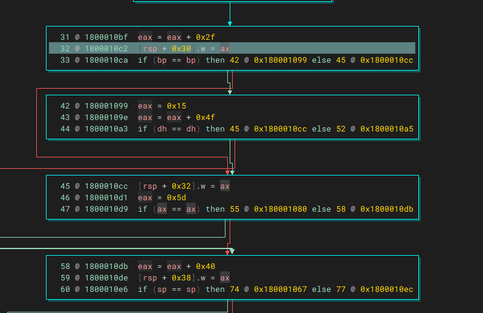
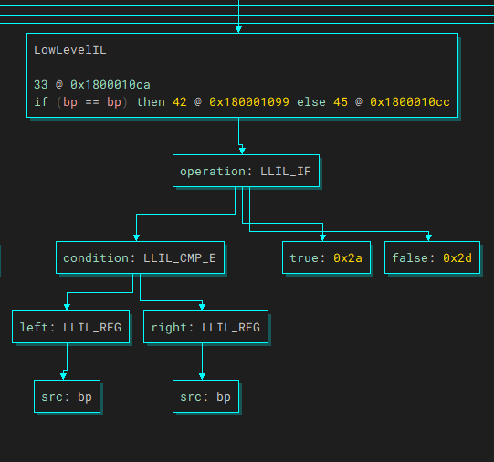
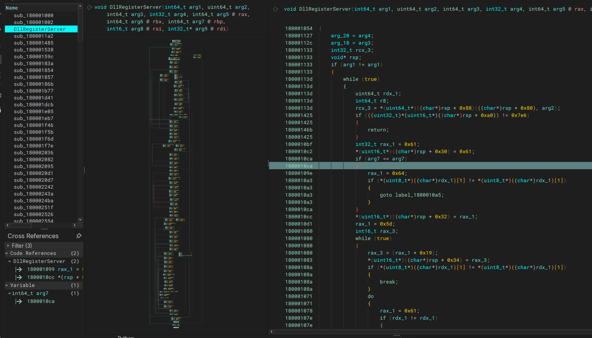
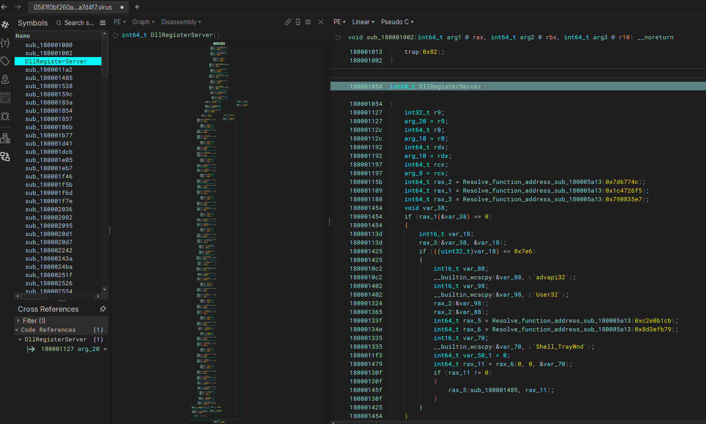
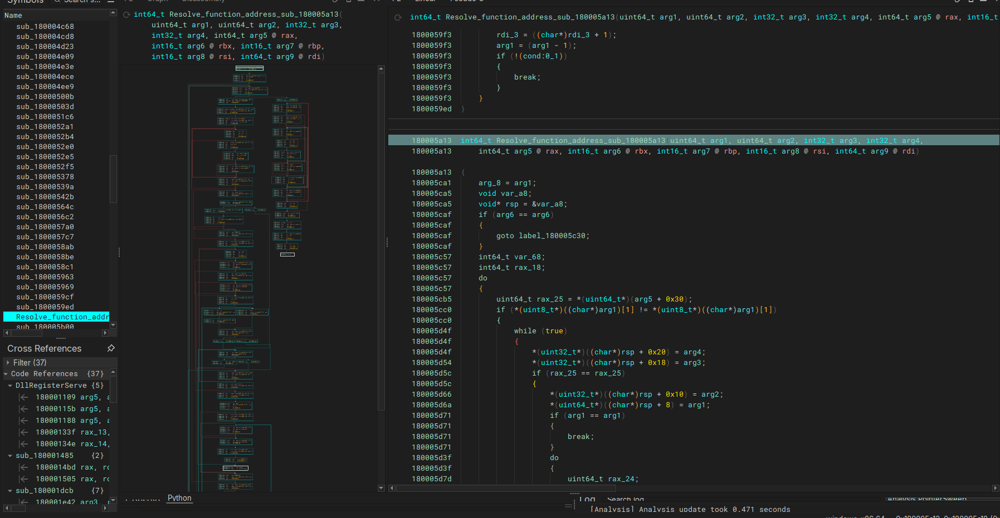
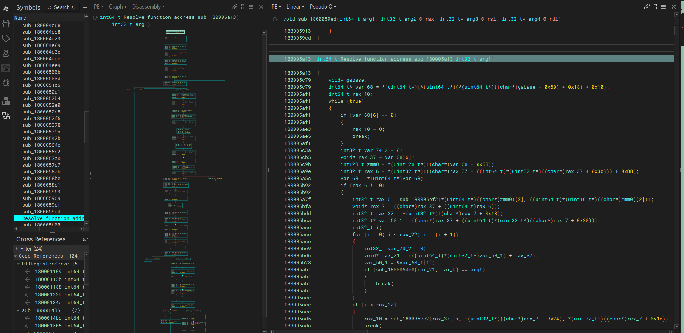

# ICEDID Malware Analysis
---

## Description
This sample teaches us how to bypass obvious opaque predicates in control flow graph. Using Binary Ninja, it is possible to patch to deobfuscate the sample since the strategy used is the same.

## The Pattern

Firstly, the basic blocks are really fragmented which are glued together via conditional and unconditional jumps. For unconditional jump statements, there are instances where ONLY one path is taken for all cases.
Notice how there are a few comparisons whereby left equals right via `cmp` instruction which would always set zero flag to zero. Depending on the jump conditions, it would only go down ONE path.



To understand this, we can reference the instruction graph for this comparison. The main IL Operation is `LLIL_IF` to check for the condition of `LLIL_CMP_E`. In the script, 
we should cover all the different IL related to `CMP`. The pattern exists where the left and right operands are of `LLIL_REG` which we can double check. Finally, to detect this, we can also make sure that the 
`src` for both `left` and `right` are the same which is the pre-requisites for the opaque predicate.



## Changing Control Flow
We can make use of the `always_branch` and `never_branch` from the patch menu which can also be done so programmatically.

```python
bv.always_branch(<instr>.address)
bv.never_branch(<instr>.address)
```

What it does is to patch to become an unconditional jump to the true statement (`always_branch`) or false statement (`never_branch`).

## Writing the Script
We have to keep track of the locations to patch with the `*_branch` API.

```python
for f in bv.functions:
    func = f.low_level_il
    patch_locations = []

    for bb in func:
        for instr in bb:
            if handle_cmp_same_regs(instr):
                print()

```

Next, we can parse the instruction in Low Level IL as per the IL Graph shown in the previous section. Note that when appending the patch location, 
I have added another value (1 or 0) to indicate if we should always branch or to never branch. This ensures that the unconditional jump statement would 
jump to the correct location. Also, the different `CMP` conditions are accounted for as well.

```
def handle_cmp_same_regs(instr):
    if instr.operation == LowLevelILOperation.LLIL_IF:
        comparison_statement = instr.operands[0]
        print("Operation : ", comparison_statement.operation)
        print(hex(instr.address))
        try:
            left_comparator = comparison_statement.left
            right_comparator = comparison_statement.right
            false_instr = instr.false
            true_instr = instr.true
        except:
            print("Skipping instruction " , instr , "@",  hex(instr.address))
            return False
    
        if hasattr(left_comparator, 'src') == False or hasattr(right_comparator, 'src') == False:
            return False
        
        # Testing agains the following
        """
        LLIL_CMP_NE - not equal
        LLIL_CMP_SLT - signed less than
        LLIL_CMP_ULT - unsigned less than
        LLIL_CMP_SLE - signed less than or equal
        LLIL_CMP_ULE - unsigned less than or equal
        LLIL_CMP_SGE - signed greater than or equal
        LLIL_CMP_UGE - unsigned greater than or equal
        LLIL_CMP_SGT - signed greater than
        LLIL_CMP_UGT - unsigned greater than
        """
        if left_comparator.src == right_comparator.src and right_comparator.operation == LowLevelILOperation.LLIL_REG and left_comparator.operation == LowLevelILOperation.LLIL_REG:
            if comparison_statement.operation == LowLevelILOperation.LLIL_CMP_E:
                patch_locations.append((instr.address, 1))
                return True
            elif comparison_statement.operation == LowLevelILOperation.LLIL_CMP_NE:
                patch_locations.append((instr.address,0))
                return True
            elif comparison_statement.operation == LowLevelILOperation.LLIL_CMP_SLE:
                patch_locations.append(instr.address, 1)
                return True
            elif comparison_statement.operation == LowLevelILOperation.LLIL_CMP_UGE:
                patch_locations.append(instr.address,1)
                return True
            elif comparison_statement.operation == LowLevelILOperation.LLIL_CMP_ULE:
                patch_locations.append(instr.address,1)
                return True
            elif comparison_statement.operation == LowLevelILOperation.LLIL_CMP_SGE:
                patch_locations.append(instr.address,1)
                return True
            elif comparison_statement.operation == LowLevelILOperation.LLIL_CMP_SGT:
                patch_locations.append(instr.address,0)
                return True
            elif comparison_statement.operation == LowLevelILOperation.LLIL_CMP_UGT:
                patch_locations.append(instr.address,0)
                return True
            elif comparison_statement.operation == LowLevelILOperation.LLIL_CMP_SLT:
                patch_locations.append(instr.address,0)
                return True
            elif comparison_statement.operation == LowLevelILOperation.LLIL_CMP_ULT:
                patch_locations.append(instr.address,0)
                return True
            return False
```

Next, we can do the actual manipulation of the control flow graph via patching.

```python
    for i in patch_locations:
        if i[1] == 1 and bv.is_always_branch_patch_available(i[0]):
            bv.always_branch(i[0])
        elif i[1] == 0 and bv.is_always_branch_patch_available(i[0]):
            bv.never_branch(i[0])
```

## Before and After

### DllRegisterServer (BEFORE)



### DllRegisterServer (AFTER)


### Resolve Function (BEFORE)


### Resolve Function (AFTER)


---

## Start to Reverse

After some renaming, we can enjoy a neat decompilation.

```c
HRESULT __stdcall DllRegisterServer_0()
{
  __int64 v1; // rax
  WCHAR user32_string[8]; // [rsp+0h] [rbp-98h] BYREF
  WCHAR advapi32_string[12]; // [rsp+10h] [rbp-88h] BYREF
  int nMaxCount; // [rsp+28h] [rbp-70h] BYREF
  __int64 v5; // [rsp+48h] [rbp-50h]
  void (__fastcall *LoadLibraryW)(WCHAR *); // [rsp+50h] [rbp-48h]
  unsigned int (__fastcall *NtQuerySystemTime)(char *); // [rsp+58h] [rbp-40h]
  char v8[8]; // [rsp+60h] [rbp-38h] BYREF
  void (__fastcall *RtlTimeToTimeFields)(char *, __int16 *); // [rsp+68h] [rbp-30h]
  __int64 (__fastcall *GetClassNameW)(HWND, LPWSTR, int); // [rsp+70h] [rbp-28h]
  void (__fastcall *EnumWindows)(__int64 (__fastcall *)(HWND, LPARAM), __int64); // [rsp+78h] [rbp-20h]
  __int16 v12[12]; // [rsp+80h] [rbp-18h] BYREF

  LoadLibraryW = Resolve_Function_Address_sub_180005A13(0x7D6774Ci64);
  NtQuerySystemTime = Resolve_Function_Address_sub_180005A13(0x1C4726F5i64);
  RtlTimeToTimeFields = Resolve_Function_Address_sub_180005A13(0x790835E7i64);
  if ( !NtQuerySystemTime(v8) )
  {
    RtlTimeToTimeFields(v8, v12);
    if ( v12[0] == 0x7E6 )                      // Check if year 2022
    {
      wcscpy(advapi32_string, L"advapi32");
      wcscpy(user32_string, L"User32");
      LoadLibraryW(user32_string);
      LoadLibraryW(advapi32_string);
      EnumWindows = Resolve_Function_Address_sub_180005A13(3269505483i64);
      GetClassNameW = Resolve_Function_Address_sub_180005A13(2369715065i64);
      v1 = (GetClassNameW)(
             0i64,
             0i64,
             &nMaxCount,
             0i64,
             *user32_string,
             *&user32_string[4],
             *advapi32_string,
             *&advapi32_string[4],
             *&advapi32_string[8],
             'l\0e\0h\0S',
             'r\0T\0_\0l',
             'n\0W\0y\0a',
             'd',
             0i64);
      v5 = v1;
      if ( v1 )
        EnumWindows(enumProc_sub_180001485, v5);
    }
  }
  return nullsub_1();
}

__int64 __fastcall enumProc_sub_180001485(HWND hwnd, LPARAM lParam)
{
  void (__fastcall *GetWindowTextW)(HWND, char *, __int64); // [rsp+0h] [rbp-228h]
  void (__fastcall *GetClassNameW)(HWND, char *, __int64); // [rsp+8h] [rbp-220h]
  char out_lpClassName[520]; // [rsp+20h] [rbp-208h] BYREF

  GetWindowTextW = Resolve_Function_Address_sub_180005A13(369508097i64);
  GetClassNameW = Resolve_Function_Address_sub_180005A13(3185422141i64);
  GetWindowTextW(hwnd, out_lpClassName, 255i64);
  GetClassNameW(hwnd, out_lpClassName, 255i64);
  if ( lParam == hwnd )
    sub_18000159C();
  return 1i64;
}

...
...
```

```

